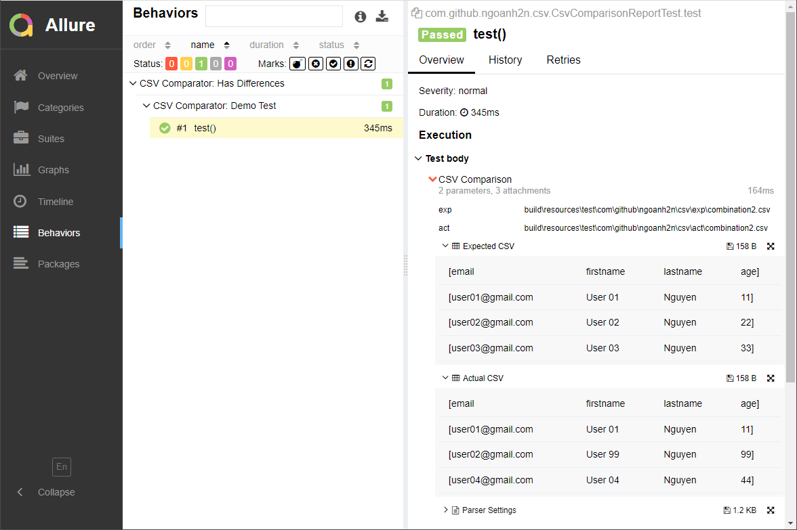

[](https://maven-badges.herokuapp.com/maven-central/com.github.ngoanh2n/csv-comparator-allure)
[](https://javadoc.io/doc/com.github.ngoanh2n/csv-comparator-allure)

# CSV Comparator for Allure
Your project is using Allure as a report framework, `csv-comparator-allure` should be used.



# Declarations
## Gradle
Add to `build.gradle`
```gradle
implementation("com.github.ngoanh2n:csv-comparator-allure:1.5.1")
```

## Maven
Add to `pom.xml`
```xml
<dependency>
    <groupId>com.github.ngoanh2n</groupId>
    <artifactId>csv-comparator-allure</artifactId>
    <version>1.5.1</version>
</dependency>
```
